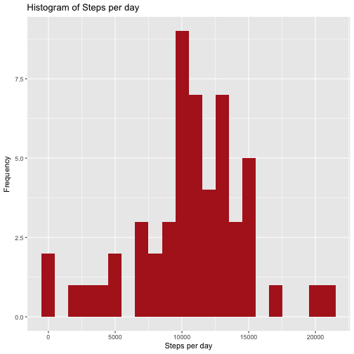
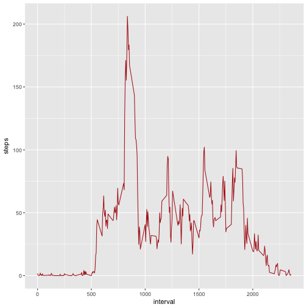
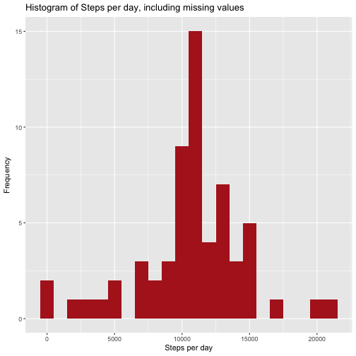
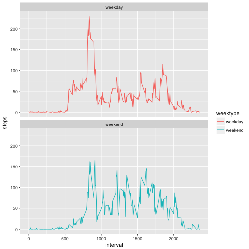

##load required package

```r
  library(ggplot2)
  library(scales)
  library(dplyr)
  library(lubridate)
```

##Loading and preprocessing the data
  We assume that the reader set the correct R working directory with the setwd() function.


  1.Load the data (i.e. read.csv())

```r
# Clear the workspace
rm(list=ls())

setwd("~/Documents/Study_materials/RProgram/course5/Project1")
unzip(zipfile = "./Data/activity.zip")

# Load the raw activity data
data <- read.csv("activity.csv", header = TRUE, sep = ',', colClasses = c("numeric", "character",
                                                                          "integer"))
```

##Tidying the data
  Change the date into dateformat using lubridate:

```r
data$date <- ymd(data$date)
str(data)
```

```
## 'data.frame':	17568 obs. of  3 variables:
##  $ steps   : num  NA NA NA NA NA NA NA NA NA NA ...
##  $ date    : Date, format: "2012-10-01" "2012-10-01" ...
##  $ interval: int  0 5 10 15 20 25 30 35 40 45 ...
```

```r
head(data)
```

```
##   steps       date interval
## 1    NA 2012-10-01        0
## 2    NA 2012-10-01        5
## 3    NA 2012-10-01       10
## 4    NA 2012-10-01       15
## 5    NA 2012-10-01       20
## 6    NA 2012-10-01       25
```

##What is mean total number of steps taken per day?
For this part of the assignment the missing values can be ignored.
  1. Calculate the total number of steps taken per day.
  2. Make a histogram of the total number of steps taken each day.
  3. Calculate and report the mean and median of the total number of steps taken per day.

#####Methodology and Result
  1. Calculate the total number of steps per day using dplyr and group by date:

```r
steps <- data %>%
  filter(!is.na(steps)) %>%
  group_by(date) %>%
  summarize(steps = sum(steps)) %>%
  print
```

```
## # A tibble: 53 × 2
##          date steps
##        <date> <dbl>
## 1  2012-10-02   126
## 2  2012-10-03 11352
## 3  2012-10-04 12116
## 4  2012-10-05 13294
## 5  2012-10-06 15420
## 6  2012-10-07 11015
## 7  2012-10-09 12811
## 8  2012-10-10  9900
## 9  2012-10-11 10304
## 10 2012-10-12 17382
## # ... with 43 more rows
```

  2.  Use ggplot for making the histogram:
  

```r
ggplot(steps, aes(x = steps)) +
  geom_histogram(fill = "firebrick", binwidth = 1000) +
  labs(title = "Histogram of Steps per day", x = "Steps per day", y = "Frequency")
```



  3. Calculate the mean and median of the total number of steps taken per day:

```r
mean_steps <- mean(steps$steps, na.rm = TRUE)
median_steps <- median(steps$steps, na.rm = TRUE)
```

  Mean steps are 10766 and median steps are 10765
  

##What is the average daily activity pattern?
  1. Make a time series plot (i.e. type = "l") of the 5-minute interval (x-axis) and the average number of steps taken, averaged across all days (y-axis).
  2. Which 5-minute interval, on average across all the days in the dataset, contains the maximum number of steps?.
  

#####Methodology and Result
  1. Calculate the average number of steps taken in each 5-minute interval per day using dplyr and group by interval:
  

```r
interval <- data %>%
  filter(!is.na(steps)) %>%
  group_by(interval) %>%
  summarize(steps = mean(steps))
```

  Use ggplot for making the time series of the 5-minute interval and average steps taken:

```r
ggplot(interval, aes(x=interval, y=steps)) +
  geom_line(color = "firebrick")
```




  2. Use which.max() to find out the maximum steps, on average, across all the days:

```r
  interval[which.max(interval$steps),]
```

```
## # A tibble: 1 × 2
##   interval    steps
##      <int>    <dbl>
## 1      835 206.1698
```

The interval 835 has, on average, the highest count of steps, with 206 steps.


##Imputing missing values
Note that there are a number of days/intervals where there are missing values (coded as NA). The presence of missing days may introduce bias into some calculations or summaries of the data.

  1. Calculate and report the total number of missing values in the dataset (i.e. the total number of rows       with NAs).
  2.  Devise a strategy for filling in all of the missing values in the dataset. The strategy does not          need to be sophisticated. For example, you could use the mean/median for that day, or the mean for        that 5-minute interval, etc.
  3.  Create a new dataset that is equal to the original dataset but with the missing data filled in.
  4.  Make a histogram of the total number of steps taken each day and calculate and report the mean and        median total number of steps taken per day. Do these values differ from the estimates from the first       part of the assignment? What is the impact of imputing missing data on the estimates of the total         daily number of steps?
  
#####Methodology and Result
  1.  Summarize all the missing values:

```r
sum(is.na(data$steps))
```

```
## [1] 2304
```

Missing values are 2304

  2.  Let’s take the approach to fill in a missing NA with the average number of steps in the same 5-min        interval.
  3.  Create a new dataset as the original and use tapply for filling in the missing values with the            average number of steps per 5-minute interval:


```r
data_full <- data
nas <- is.na(data_full$steps)
avg_interval <- tapply(data_full$steps, data_full$interval, mean, na.rm=TRUE, simplify=TRUE)
data_full$steps[nas] <- avg_interval[as.character(data_full$interval[nas])]
```
  
  Check that there are no missing values:
  

```r
sum(is.na(data_full$steps))
```

```
## [1] 0
```

  No more missing values.

  4.  Calculate the number of steps taken in each 5-minute interval per day using dplyr and group by            interval. Use ggplot for making the histogram:

```r
steps_full <- data_full %>%
  filter(!is.na(steps)) %>%
  group_by(date) %>%
  summarize(steps = sum(steps)) %>%
  print
```

```
## # A tibble: 61 × 2
##          date    steps
##        <date>    <dbl>
## 1  2012-10-01 10766.19
## 2  2012-10-02   126.00
## 3  2012-10-03 11352.00
## 4  2012-10-04 12116.00
## 5  2012-10-05 13294.00
## 6  2012-10-06 15420.00
## 7  2012-10-07 11015.00
## 8  2012-10-08 10766.19
## 9  2012-10-09 12811.00
## 10 2012-10-10  9900.00
## # ... with 51 more rows
```

  plotting histogram
  

```r
ggplot(steps_full, aes(x = steps)) +
  geom_histogram(fill = "firebrick", binwidth = 1000) +
  labs(title = "Histogram of Steps per day, including missing values", x = "Steps per day", y = "Frequency")
```



  Calculate the mean and median steps with the filled in values:
  

```r
mean_steps_full <- mean(steps_full$steps, na.rm = TRUE)
median_steps_full <- median(steps_full$steps, na.rm = TRUE)
```


```r
mean_steps_full
```

```
## [1] 10766.19
```

```r
median_steps_full
```

```
## [1] 10766.19
```

The impact of imputing missing data with the average number of steps in the same 5-min interval is that both the mean and the median are equal to the same value: 10766


##Are there differences in activity patterns between weekdays and weekends?

For this part the weekdays() will come handy. Use the dataset with the filled-in missing values for this part.

  1. Create a new factor variable in the dataset with two levels - “weekday” and “weekend” indicating          whether a given date is a weekday or weekend day.
  2. Make a panel plot containing a time series plot (i.e. type = "l") of the 5-minute interval (x-axis)       and the average number of steps taken, averaged across all weekday days or weekend days (y-axis).

#####Methodology and Result
  1. Use dplyr and mutate to create a new column, weektype, and apply whether the day is weekend or weekday:
  

```r
data_full <- mutate(data_full, weektype = ifelse(weekdays(data_full$date) == "Saturday" | weekdays(data_full$date) == "Sunday", "weekend", "weekday"))
data_full$weektype <- as.factor(data_full$weektype)
head(data_full)
```

```
##       steps       date interval weektype
## 1 1.7169811 2012-10-01        0  weekday
## 2 0.3396226 2012-10-01        5  weekday
## 3 0.1320755 2012-10-01       10  weekday
## 4 0.1509434 2012-10-01       15  weekday
## 5 0.0754717 2012-10-01       20  weekday
## 6 2.0943396 2012-10-01       25  weekday
```

  2. Calculate the average steps in the 5-minute interval and use ggplot for making the time series of the 5-minute interval for weekday and weekend, and compare the average steps:

```r
interval_full <- data_full %>%
  group_by(interval, weektype) %>%
  summarise(steps = mean(steps))
s <- ggplot(interval_full, aes(x=interval, y=steps, color = weektype)) +
  geom_line() +
  facet_wrap(~weektype, ncol = 1, nrow=2)
print(s)
```



From the two plots it seems that the test object is more active earlier in the day during weekdays compared to weekends, but more active throughout the weekends compared with weekdays (probably because the oject is working during the weekdays, hence moving less during the day)
